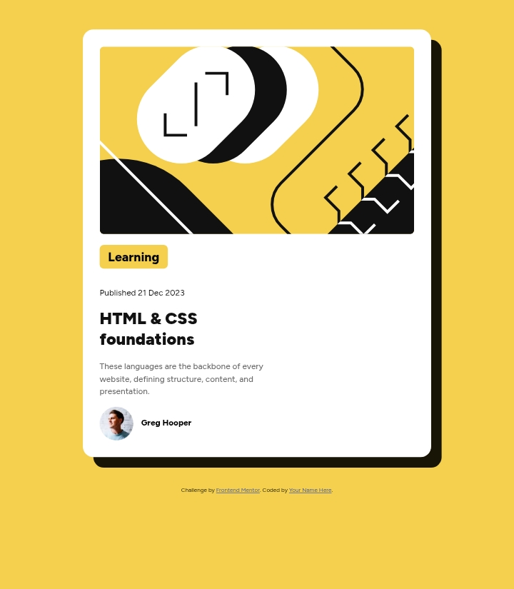

# Frontend Mentor - Blog-Preview-Card-Main solution

This is a solution to the [Blog-Preview-Card-Main challenge on Frontend Mentor](https://www.frontendmentor.io/challenges/blog-preview-card-ckPaj01IcS). Frontend Mentor challenges help me improve my coding skills by building realistic projects. 

## Table of contents

- [Overview](#overview)
  - [The challenge](#the-challenge)
  - [Screenshot](#screenshot)
  - [Links](#links)
- [My process](#my-process)
  - [Built with](#built-with)
  - [What I learned](#what-i-learned)
  - [Useful resources](#useful-resources)
- [Author](#author)
- [Acknowledgments](#acknowledgments)


## Overview

### Screenshot




### Links

- Solution URL: [My GitHub URL](https://github.com/AbbanMuhammad/blog-preview-card-main.git)
- Live Site URL: [Live Preview ](https://abbanmuhammad.github.io/blog-preview-card-main/)

## My process

### Built with

- Semantic HTML5 markup
- CSS custom propertie

### What I learned

I learned a lot also from this challenge, especially how to use box-shadow. In CSS I've learned how to make image to fluid inside its container.

```css
.container{
    border-radius: 20px;
    box-shadow: 20px 20px 0 rgba(0,0,0,0.9);
}
```

### Useful resources

- [Front-End Mentor](https://www.frontendmentor.io) - This helped me to select the challenge I'd like practice. I really like the challenge opportunities and will use it improve myself.
- [The Odin Project](https://www.theodinproject.com/) - This is an amazing site where I enrolled myself in to learn more on frontend concepts. I'd recommend it to anyone still learning this concept.

## Author

- Website - [Sani Ismail](https://www.github.com/AbbanMuhammad)
- Frontend Mentor - [@AbbanMuhammad](https://www.frontendmentor.io/profile/AbbanMuhammad)
- Twitter - [@Abuu__Muhammad](https://x.com/Abuu__Muhammad)

## Acknowledgments

I acknowledged the entire team of frontendmentor for providing these challenges, where not only me but anybody in this field can get enrolled Free and choose from the numerous challenges he likes. I really appreciate your effort.
